```mermaid
classDiagram
    class Game {
        id: Guid
        ownerId: Guid
        mapId: Guid
        board: Board
        players: User[]
        turns: Turn[]
        daysPerTurn: number
        turnStartHour: number
        timezone: string
        startDate: number
        endDate: number
        inProgress: bool
        isDeleted: bool
    }

    class Board {
        providences: Providence[]
        supplyCenters: SupplyCenter[]
    }

    class User {
        id: Guid
        firstName: string
        lastName: string
        username: string
        password: string
        salt: Uint8Array
        createdDate: number
        isDeleted: bool
    }

    class Player {
        id: Guid
        userId: Guid
        powerId: Guid
        isPlaying: bool
    }

    class Turn {
        id: Guid
        phaseId: Guid
        orders: Order[]
        turnNumber: number
        startDate: number
        endDate: number
    }

    class Order {
        id: Guid
        phaseId: Guid
        playerId: Guid
        createdDate: number
        value: string
        isDeleted: bool
    }

    class Phase {
        id: Guid
        name: string
        description: string
        phaseOrder: number
    }

    class GreatPower {
        id: Guid
        name: string
        color: string
    }

    class Map {
        id: Guid
        name: string
        providences: Providence[]
        supplyCenters: SupplyCenter[]
    }

    class Providence {
        id: Guid
        name: string
        shortCode: string
        supplyCenterId: Guid | null
        unitX: number
        unitY: number
        type: army | fleet | all
        routes: Guid[]
        controlledBy: Guid | null
    }

    class SupplyCenter {
        id: Guid
        providenceId: Guid
        unitX: number
        unitY: number
        controlledBy: Guid | null
    }
```

# Diplomacy API

## Terraform state

Terraform is configured to store state in S3 at
`s3://diplomacy-api-terraform-state/diplomacy-api/terraform.tfstate`.

Create the state bucket before initializing Terraform:

```sh
aws s3api create-bucket \
  --bucket diplomacy-api-terraform-state \
  --region us-west-2 \
  --create-bucket-configuration LocationConstraint=us-west-2
```

Then migrate the current local state:

```sh
cd terraform
terraform init -migrate-state
```


